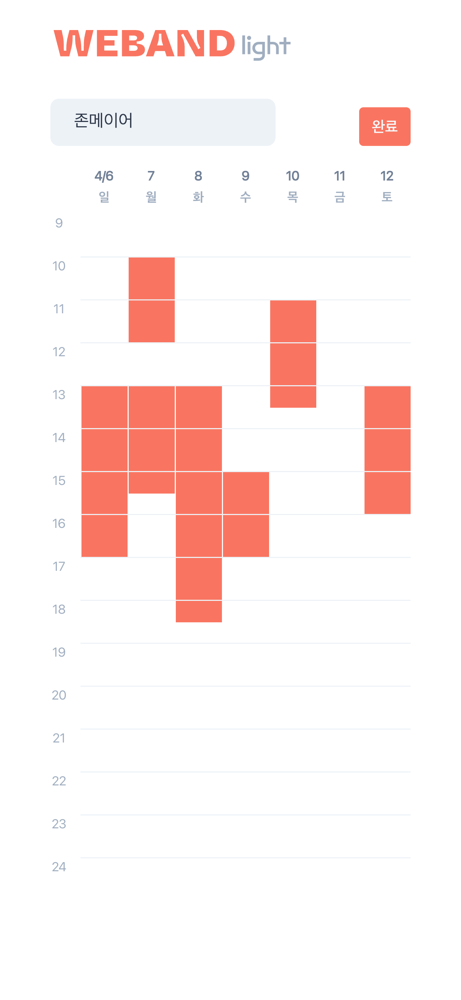
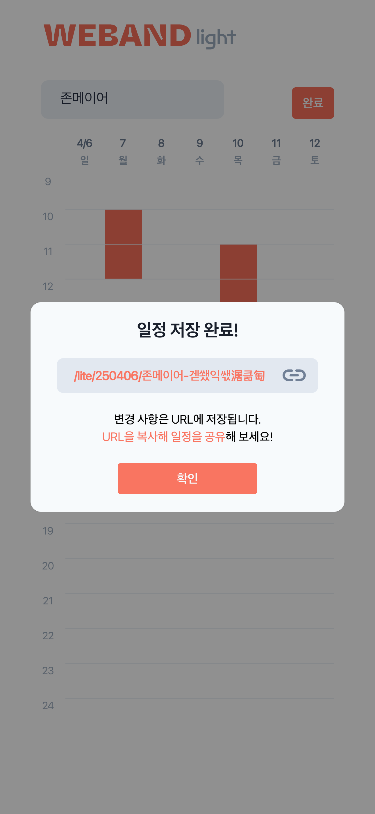
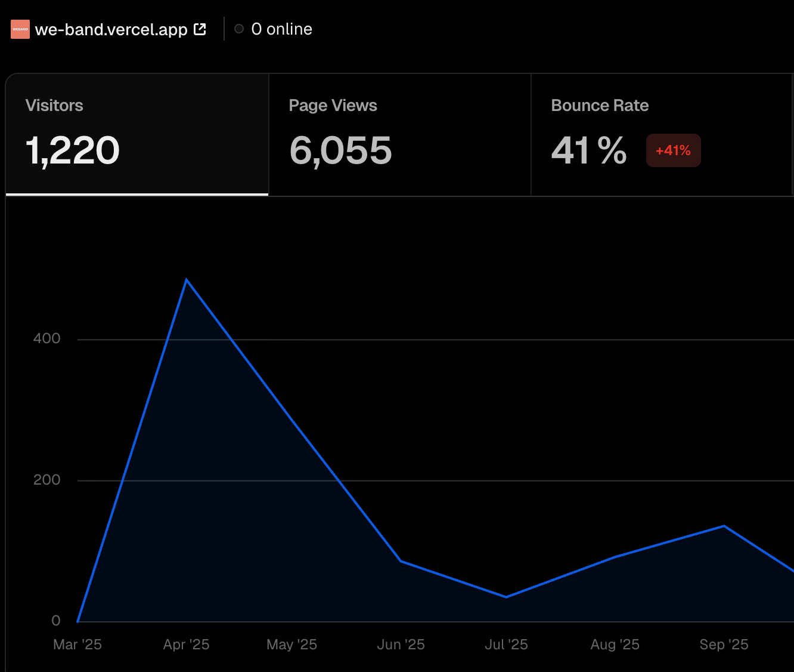

# WeBand (weband)

<p align="center">
  
  
  
</p>
팀원 간 일정을 쉽고 빠르게 조율할 수 있는 웹페이지입니다.  
기준 날짜를 선택해 일정 보드를 만들고, URL을 공유해 각 팀원이 가능한 시간을 입력하면 공통 가능 시간을 한눈에 확인할 수 있습니다.

## 프로젝트 개요

- 목적: 팀 단위 미팅/스터디/프로젝트 일정 조율
- 방식: 백엔드 서버 없이 URL 기반으로 일정 생성 및 공유
- 범위: 7일 단위 시간표 조율

## 핵심 기능

- 기준 날짜 선택 후 1주 일정 보드 생성
- 사용자별 가능 시간 입력/수정
- 일정 데이터 URL 인코딩 저장 및 링크 공유
- 전체 보기/사용자별 보기 전환
- 시간대별 참여 가능 인원 수 시각화

## URL 동작 방식

- 기본 경로: `/lite`
- 날짜 포함 경로: `/lite/{YYMMDD}`
- 사용자 일정 포함 경로: `/lite/{YYMMDD}/{이름.인코딩된일정}`
- 변경 사항은 URL에 반영되며, 공유한 URL만으로 동일한 일정 상태를 재현할 수 있습니다.

## 인코딩 최적화 로직

- 일정 상태를 고정 길이 비트열(`SCHEDULE_BIT_LENGTH`)로 표현합니다. (현재 Lite 기준 `210bit`)
- 인코딩은 하이브리드 방식입니다.
- 방식 A(비트셋): 비트열을 `BigInt`로 변환한 뒤 URL-safe 문자셋 `A-Z a-z 0-9 - _`로 인코딩합니다.
- 방식 B(구간 압축): `1`이 연속된 구간을 `(start, length)` 쌍으로 압축해 저장합니다.
- 두 방식 결과를 모두 만든 뒤, 더 짧은 문자열을 자동으로 선택합니다.
- 스케줄이 전부 `0`인 경우는 `"0"` 1글자로 저장합니다.
- 사용자별 URL 세그먼트는 `{name}.{encodedSchedule}` 형태로 구성합니다.
- 디코딩 시 인코딩 문자열을 다시 비트열로 복원하고, `padStart/slice`로 고정 길이 정규화를 수행합니다.
- 성과 1: 비트셋 상한은 최대 `35 bytes`이지만, 연속 구간이 많은 일정은 더 짧아집니다.
- 성과 2: 예시(두 구간 일정) `bitset 30자 -> 구간압축 9자`까지 단축됩니다.
- 성과 3: URL-safe 문자만 사용해 퍼센트 인코딩 오버헤드를 줄이고, 복사/공유 시 안정적으로 유지됩니다.

## 실 사용자

<p align="center">
  
</p>
출시 후 1달 안에 500명 이상의 사용자 유입이 있었습니다.

## 한계점

초반에는 쉬운 사용성 덕분에 빠르게 사용자 유입이 이루어졌지만,
일정을 추가할 때마다 URL이 변경되어 매번 새 링크를 다시 공유해야 하는 불편함이 있었습니다.

## 기술 스택

- Language: TypeScript
- Framework: React 19
- Build Tool: Vite 6
- Styling: styled-components, SCSS
- Routing: react-router-dom
- State: zustand
- Package Manager: Yarn 4

## 시작하기

```bash
yarn install
yarn dev
```

- 기본 개발 서버: `http://localhost:5173`

## 스크립트

- `yarn dev`: 개발 서버 실행
- `yarn build`: 프로덕션 빌드
- `yarn preview`: 빌드 결과 로컬 미리보기
- `yarn lint`: ESLint 검사

## Branch Naming Rule

```text
<type>/<issue-number>-<short-description>

feat/1234-add-user-login
fix/5678-fix-login-error
release/1.2.0
```

- `feat/`: 새로운 기능 개발
- `fix/`: 버그 수정
- `hotfix/`: 긴급 버그 수정
- `release/`: 릴리즈 준비
- `chore/`: 문서/설정/빌드 등 비기능 작업

## Git Commit 규칙

- `feat`: 새로운 기능 추가
- `fix`: 버그 수정
- `refactor`: 리팩토링
- `style`: 포맷/스타일 수정
- `test`: 테스트 추가/수정
- `docs`: 문서 작업
- `chore`: 빌드/설정/의존성 작업

## 프로젝트 구조

```text
src/
├── assets/         # 이미지, 아이콘 등 정적 리소스
├── components/     # 캘린더/온보딩/헤더 등 UI 컴포넌트
├── constants/      # 시간, 알림 등 상수
├── icons/          # SVG 아이콘 컴포넌트
├── layout/         # 메인/라이트 레이아웃
├── pages/          # 라우트 페이지
├── store/          # Zustand 스토어
├── styles/         # 전역 스타일 및 테마
├── types/          # 타입 정의
├── utils/          # URL/날짜 유틸리티
├── App.tsx
└── main.tsx
```
